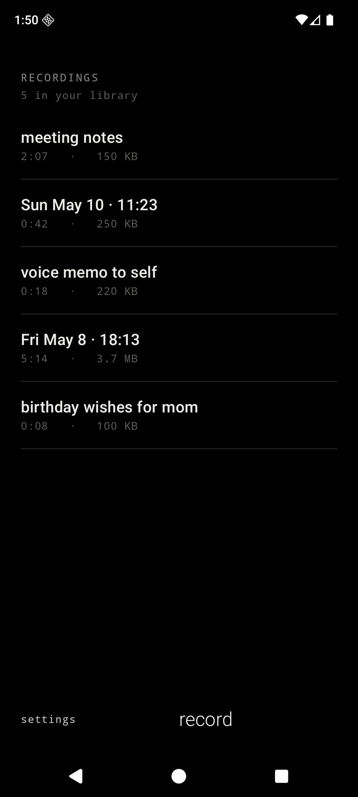
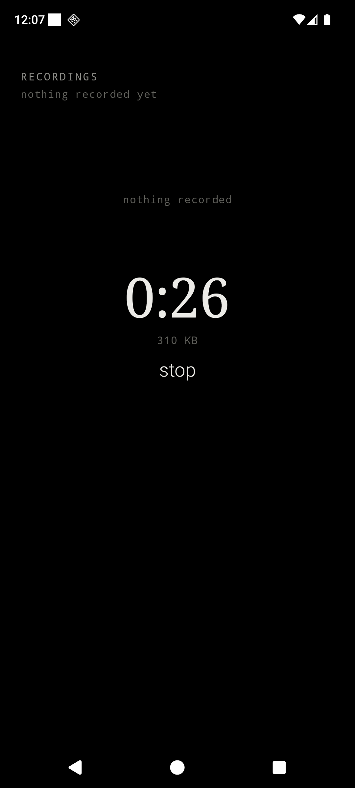
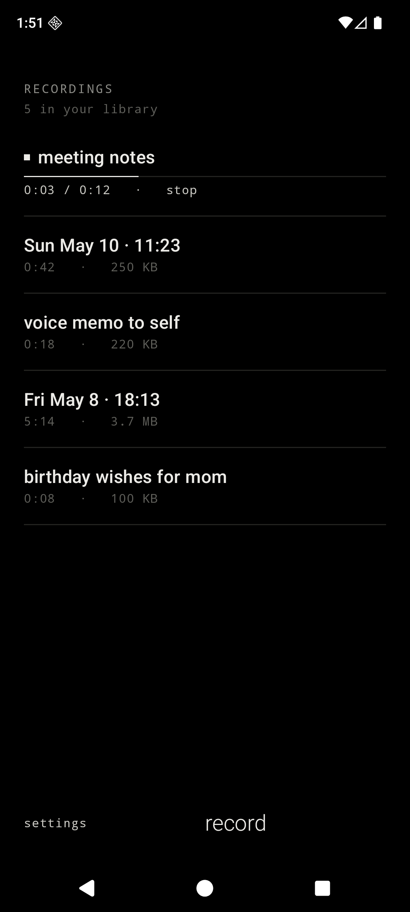
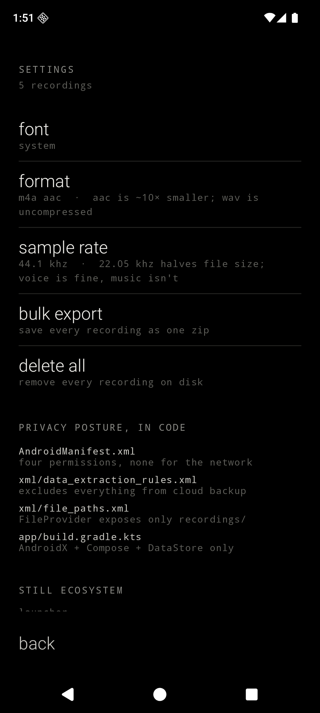

<div align="center">

# Still Voice

#### A quiet voice recorder for Android.

<br>

&nbsp;&nbsp;&nbsp;

<br>

</div>

---

Still Voice is a minimalist, privacy-first Android voice recorder. It is monochrome, OLED-first, text-first, and designed to feel like the recorder a beautiful dumb phone would ship if it had a microphone. It is the audio companion to [Still Notes](../still-notes), [Still](../still-launcher), and [Still Cal](../still-cal) — same temperament, same fonts, same refusal to phone home.

It declares no internet permission. It ships no analytics. It depends on neither Firebase nor Google Play Services. Recordings are plain `.m4a` (AAC) or `.wav` (PCM) files in app-private storage, captured by the platform `MediaRecorder` and `AudioRecord` — no third-party audio library, no transcription model, no on-device speech-to-text. It runs on any Android device from API 26 up.

## What Still Voice does

- A reverse-chronological list of recordings as the home screen, each row showing **derived label, `mm:ss` duration, and file size**.
- Tap a row to **play it inline**: a 1dp hairline scrubber animates across the row, a small filled square marks the playing row, and the bottom caption reads `0:43 / 1:12  ·  stop`. Drag the scrubber to seek.
- A **recording bar** pinned to the bottom of the list. Idle: a single lowercase `record` verb. Recording: a serif `mm:ss` counter, live file size, and a `stop` verb. The counter ticks at 1Hz, not 60Hz.
- A **foreground service** keeps the recording alive while the screen is off or the app is backgrounded, with a sticky notification showing the live elapsed time and a `stop` action. It is the only notification this app ever posts.
- **Long-press a row** for an inline action sheet: `rename`, `share`, `export`, `delete`. Delete asks for a second tap to confirm.
- A **rename screen**: a single `BasicTextField` for the user-typed label. Names live in the JSON index, not in the filename — they may contain spaces and unicode without filename escaping.
- A **settings screen**: font preset (System / Editorial / Terminal / Grotesk), encoding format (`m4a aac` / `wav pcm`), sample rate (`44.1 khz` / `22.05 khz`), bulk export, delete all.
- **System share-out** through `ACTION_SEND` and a `FileProvider` exposing only the recordings directory.
- **Single export** through SAF `CreateDocument` writes the bytes unchanged to wherever the user picks. **Bulk export** writes a single `.zip` of every recording, each named `<safe-label-or-timestamp>.<ext>`.
- All four font presets shipped: **System** (serif + sans + mono), **Editorial** (Cormorant + Inter + Plex), **Terminal** (Plex Mono throughout), **Grotesk** (Instrument Serif + Space Grotesk).

## What Still Voice refuses to do (and what it asks for honestly)

| Permission | Why it is unavoidable |
| --- | --- |
| `RECORD_AUDIO` | The only way to capture from the microphone. Asked the first time the user taps `record`. |
| `FOREGROUND_SERVICE` | Required on Android 9+ to keep the recording alive while the screen is off or the app is backgrounded. Without it, a one-hour recording becomes a thirty-second one the moment the user looks at any other app. |
| `FOREGROUND_SERVICE_MICROPHONE` | Required on Android 14+ as the specialization of `FOREGROUND_SERVICE` for services that use the microphone. The OS rejects starting a mic-using foreground service without it. |
| `POST_NOTIFICATIONS` | Required on Android 13+ to surface the foreground-service notification. The system silently kills the foreground service if the notification can't appear. Still Voice posts exactly one notification, only while a recording is in progress. |

What Still Voice refuses to do:

- No `INTERNET` permission. No cloud upload, no "share to drive" preset, no podcast publishing, no sync.
- No transcription, no on-device speech-to-text, no AI tagging. Whisper.cpp is FOSS and tempting; it is also a 50MB APK regression and a direct violation of the still pact's "AI bolt-ons" line.
- No third-party audio library, no DSP, no noise suppression beyond `MediaRecorder` defaults.
- No waveform visualization. A scrubber is enough; an animated waveform is decoration.
- No multi-track, no overdub, no pause-and-resume mid-recording, no scheduled recording, no widget, no quick-settings tile.
- No `+` button. New recordings are reached via the bottom-bar `record` verb.
- No import. Still Voice is for *your* voice; if you have an audio file from elsewhere, it already lives in your file manager.
- No analytics, no telemetry, no Firebase, no Google Play Services, no ads.
- No cloud backup of recordings — `data_extraction_rules.xml` excludes every domain.

## Privacy posture, in code

| File | What it guarantees |
| --- | --- |
| `app/src/main/AndroidManifest.xml` | Four permissions disclosed in honest comments — `RECORD_AUDIO`, `FOREGROUND_SERVICE`, `FOREGROUND_SERVICE_MICROPHONE`, `POST_NOTIFICATIONS`. None for the network. |
| `app/src/main/res/xml/data_extraction_rules.xml` | Excludes every sharedpref / file / database domain from cloud backup and device transfer. |
| `app/src/main/res/xml/file_paths.xml` | The `FileProvider` exposes only `recordings/` — other apps never see the index or settings. |
| `app/build.gradle.kts` | Dependencies only on AndroidX, Compose, and DataStore — no Firebase, no GMS, no analytics SDK, no audio library, no transcription model. |

## Architecture

```text
MainActivity
└── StillVoiceApp                          single-Activity Compose shell, hand-rolled router
    ├── RecordingsRepository               audio files on disk + JSON index, ioMutex-guarded
    ├── PreferencesRepository              DataStore — font preset, format, sample rate
    ├── IoActions                          SAF write, share-intent, .zip export
    ├── recorder
    │   ├── RecordingService               foreground service, owns MediaRecorder/AudioRecord
    │   ├── RecorderController             singleton-ish, exposed via LocalRecorderController
    │   ├── RecorderBus                    process-wide MutableSharedFlow bridging the two
    │   └── WavRecorder                    AudioRecord + 44-byte RIFF header for the WAV path
    ├── player
    │   └── PlayerController               one MediaPlayer instance, mutually exclusive with recorder
    └── Compose surfaces
        ├── ui/list/RecordingsListScreen   list + RecordingBar + inline play scrubber + action sheet
        ├── ui/rename/RenameScreen         single BasicTextField for the user-typed label
        ├── ui/settings/SettingsScreen     font preset, format, sample rate, bulk export, delete all
        ├── ui/components/                 StillDivider, StillMenuItem, StillScrubber, StillVerb
        └── ui/theme/                      StillColors, StillTypography, StillFontFamilies, StillTheme
```

Kotlin, Jetpack Compose, AGP 9.2.1, Gradle Kotlin DSL. Recordings are stored as `<uuid>.m4a` or `<uuid>.wav` in `filesDir/recordings/` plus a single `index.json` for fast list rendering. Navigation Compose is intentionally avoided; a small sealed-class router lives in `StillVoiceApp.kt`. Index entries are encoded as JSON via `org.json` (no extra serialization dependency). Export, bulk export, and share-out all go through `ActivityResultContracts` — Still Voice never holds a `Uri` past the system picker callback.

## Gestures

| Gesture | Effect |
| --- | --- |
| Tap a row (idle) | Play that recording inline |
| Tap a row (already playing) | Stop playback |
| Tap a different row while one is playing | Stop the first, start the second |
| Drag the inline scrubber | Seek |
| Long-press a row | Open the inline action sheet (rename / share / export / delete) |
| Tap `record` (idle) | Start a new recording (prompts for `RECORD_AUDIO` if not granted) |
| Tap `stop` (recording) | Finalize the recording, new row appears at the top |
| Tap `settings` in the bottom bar | Navigate to settings |
| Tap `back` in settings or rename | Return to the list |
| Tap the foreground notification | Open the app to the list with the bar already in `Recording` |
| Tap the notification's `stop` action | Finalize the recording without opening the app |

## Design language

- OLED black background. Soft white primary text. Gray secondary text. Hairline (`#232320`) dividers.
- Serif for the live elapsed-time `Counter` (the only loud type on the screen). Sans-serif for row titles and menu items. Monospace for kickers, captions, the duration `mm:ss`, and the file-size figures.
- Lowercase for verbs (`record`, `stop`, `play`, `rename`, `share`, `export`, `delete`, `cancel`, `back`, `save`). Title case only when the user typed it themselves.
- No ripple. Fade-only transitions. No bouncy motion, no colorful accents.
- The inline play scrubber is 1dp hairline, `SoftWhite` filled, `Hairline` runway. No knob.
- Open-source fonts shipped under their respective OFL licenses: IBM Plex Mono, Inter, Cormorant Garamond, Instrument Serif, Space Grotesk.

## Build and install

Requirements: **JDK 17**, the **Android SDK** with `platforms;android-36` and `build-tools;36.0.0`. The Gradle wrapper (9.4.1) is bundled.

```bash
./gradlew assembleDebug
adb install -r app/build/outputs/apk/debug/app-debug.apk
```

The app appears as **still voice** in the launcher (or, if you're using [Still](../still-launcher), in the all-apps list).

## Notes for GrapheneOS

Still Voice depends on no part of Google Play Services and declares only the four recording-related permissions, so it runs cleanly on a fresh GrapheneOS profile. SAF export uses the system documents UI, so where recordings are written on disk depends on your storage scope policy — Still Voice never asks for `MANAGE_EXTERNAL_STORAGE` or `READ_MEDIA_AUDIO`.

## Status

MVP. Builds against AGP 9.2.1 / Kotlin 2.3.21 / `compileSdk 36`. The four spec.md §15 open questions resolved in v0.1: pause-and-resume deferred to v0.2, inline waveform deferred, auto-delete-after deferred (silently deleting voice would violate the pact), and **WAV is shipped** via a small `AudioRecord` + RIFF-header writer (`WavRecorder.kt`) — no third-party audio library was added. Not yet daily-driven on hardware.

## License

MIT. See [`LICENSE`](LICENSE).
